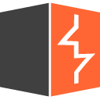

<h3 align="center">
  Welcome to Barathkumar profile! 
  
 </h3>

  </a>

 
  

## Streak stats

  <a href="https://github.com/Barathkumarjk/github-readme-streak-stats">
    

 

## My Online Presence 👇

    
    
### Tools, languages, and other things that I like to work with 🛠️
<table>
  <tr>
      <td align="center" width="96">
      
       HTML
     </td>

   <td align="center"  width="96">
      
       C
    </td>

   <td align="center"  width="96">
      
       R
    </td>

   <td align="center"  width="96">
      
       Python
    </td>
    <td align="center"  width="96">
      
       Pandas
    </td>

   <td align="center"  width="96">
      
       Numpy
    </td>
    
   <td align="center"  width="96">
      
       Tkinter
    </td>
    
  </tr>
</table>
<table>
  <tr>
    
   <td align="center"  width="96">
      
       Linux
    </td>

   <td align="center"  width="96">
      
       Github
    </td>

    

   <td align="center"  width="96">
      
       HTB
    </td>

   <td align="center"  width="96">
      
       THM
    </td>

  <td align="center"  width="96">
      
       CTFs
    </td>
  
   <td align="center"  width="96">
      
       Burp
    </td>

  </tr>
</table>

<!--
**BarathkumarJK/BarathkumarJK** is a ✨ _special_ ✨ repository because its `README.md` (this file) appears on your GitHub profile.

Here are some ideas to get you started:

- 🔭 I’m currently working on ...
- 🌱 I’m currently learning ...
- 👯 I’m looking to collaborate on ...
- 🤔 I’m looking for help with ...
- 💬 Ask me about ...
- 📫 How to reach me: ...
- 😄 Pronouns: ...
- ⚡ Fun fact: ...
-->
